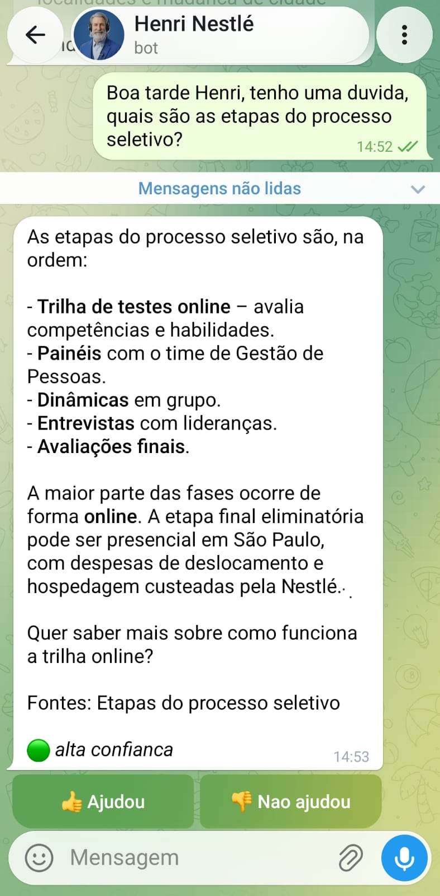
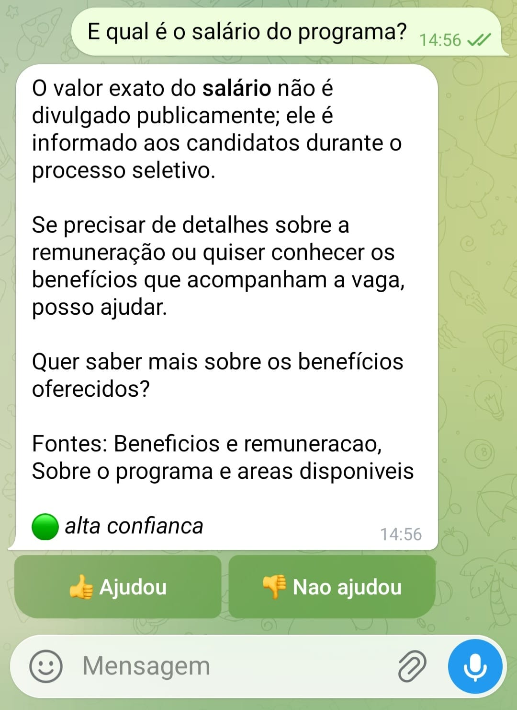
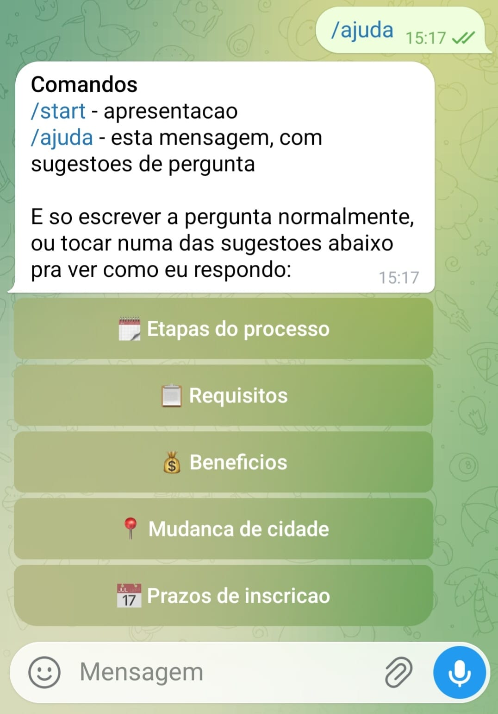
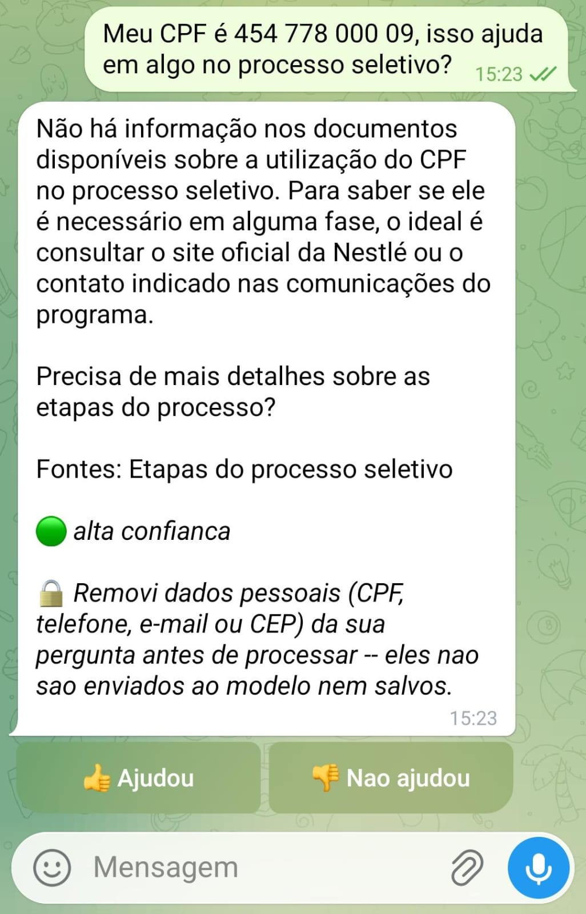

# Henri

[](https://github.com/lucasbertanicarneiro/nestbot/actions/workflows/tests.yml)

Assistente de Telegram que responde dúvidas de candidatos ao Programa de Trainee
da Nestlé, com arquitetura RAG e um dashboard que mede a qualidade da própria
recuperação. O nome é uma homenagem a Henri Nestlé, fundador da marca.

> Projeto pessoal, sem vínculo com a Nestlé. Bot não-oficial; o nome é uma
> homenagem, não uma personificação da empresa ou de seu fundador. A base de
> conhecimento é montada a partir de comunicados e páginas públicas.

---

## Em ação

Resposta sourced, com selo de confiança da recuperação:



E o outro lado da moeda — quando o contexto não cobre a pergunta (salário
exato, por exemplo, não é divulgado publicamente), o bot admite em vez de
inventar:



`/ajuda` traz sugestões de pergunta tocáveis, pra quem não sabe por onde
começar:



E se alguém digitar um dado pessoal por engano, o bot redige antes de
processar e avisa que fez isso:



---

## O problema

Quem se inscreve num programa de trainee tem as mesmas dúvidas repetidas — prazo,
requisitos, benefícios, se vai precisar mudar de cidade — e a resposta está
espalhada por comunicados de imprensa, FAQ e páginas institucionais. Ninguém lê
tudo isso.

Um chatbot resolve a parte fácil. A parte difícil é garantir que ele **não invente
resposta** sobre um processo seletivo real, onde informação errada custa caro para
quem está se candidatando.

Este projeto trata a confiabilidade como requisito de engenharia, não como
detalhe: o sistema mede continuamente se as próprias respostas estão sustentadas
nos documentos, e o dashboard existe para expor isso.

---

## Arquitetura

```
                       pergunta (Telegram)
                              │
                    ┌─────────▼─────────┐
                    │  Roteador (LLM    │   modelo rápido/barato (configurável)
                    │  rápido)          │   classifica categoria + escopo
                    └─────────┬─────────┘
                              │
              ┌───────────────┴───────────────┐
              │                               │
     ┌────────▼────────┐            ┌─────────▼────────┐
     │ Busca vetorial  │            │  Busca lexical   │
     │ pgvector HNSW   │            │  tsvector PT-BR  │
     │ (semântica)     │            │  (termo exato)   │
     └────────┬────────┘            └─────────┬────────┘
              └───────────────┬───────────────┘
                    ┌─────────▼─────────┐
                    │  Fusão RRF        │   funde por posição, não por score
                    └─────────┬─────────┘
                              │
                    ┌─────────▼─────────┐
                    │  Guarda-corpo     │   score < limiar → admite que não sabe
                    └─────────┬─────────┘
                              │
                    ┌─────────▼─────────┐
                    │  Geração          │   LLM forte (configurável), restrito ao contexto
                    └─────────┬─────────┘
                              │
              ┌───────────────┴───────────────┐
              │                               │
     ┌────────▼────────┐            ┌─────────▼────────┐
     │ Resposta ao     │            │  Avaliador       │  LLM-as-judge
     │ usuário + 👍👎  │            │  (assíncrono)    │  faithfulness etc.
     └─────────────────┘            └─────────┬────────┘
                                              │
                                    ┌─────────▼─────────┐
                                    │ Postgres → views  │
                                    │ → Metabase        │
                                    └───────────────────┘
```

### Decisões técnicas e o porquê

| Decisão | Motivo |
|---|---|
| **Busca híbrida (vetorial + lexical)** | Busca semântica pura erra termo exato e entidade rara — "9 de setembro", "Ituiutaba", "AWS Cloud Practitioner". A busca lexical do Postgres cobre esse buraco. |
| **RRF em vez de soma ponderada** | Funde as duas listas pela *posição*, não pelo score. Evita normalizar escalas incompatíveis (distância de cosseno vs `ts_rank`). |
| **pgvector dentro do Postgres** | Um banco só para dado relacional e vetorial. Menos infra, e o dashboard cruza embeddings e telemetria com um `JOIN` comum. |
| **Embeddings locais (`multilingual-e5-small`)** | O Groq não expõe endpoint de embedding. Rodar local dá custo zero, tira a ingestão do rate limit e mantém qualidade boa em português. |
| **Groq para inferência** | Free tier sem cartão e inferência em LPU — latência baixa importa num bot de chat, onde a pessoa está esperando. |
| **Guarda-corpo por limiar** | Se nenhum trecho passa do limiar de confiança, o bot **não gera resposta**. Num contexto de processo seletivo real, "não sei" é melhor que um palpite plausível. |
| **Índice HNSW** | Melhor recall/latência que IVFFlat em bases pequenas, e não exige treino prévio do índice. |
| **Avaliação assíncrona** | O julgamento roda em thread separada: mede qualidade sem custar latência para quem está esperando a resposta. |
| **ID do Telegram hasheado** | Telemetria não precisa de identidade. Hash com sal antes de gravar. |
| **Redação de PII por regex** | CPF/telefone/e-mail/CEP são removidos da pergunta antes dela chegar ao Groq ou ao banco — protege as duas pontas com uma única checagem na entrada. |
| **Metabase lê só views** | Desacopla o dashboard do schema. Se as tabelas mudarem, só a view muda e o dashboard continua funcionando. |

---

## Stack

- **Python 3.12**
- **PostgreSQL 16** + **pgvector** (busca vetorial) + **tsvector** (busca lexical)
- **Groq API** — modelos configuráveis via `.env` (`GROQ_MODELO_GERACAO`,
  `GROQ_MODELO_RAPIDO`); catálogo do Groq muda com frequência
- **sentence-transformers** — `intfloat/multilingual-e5-small`, 384 dimensões
- **python-telegram-bot** — polling (implementado e é como o bot roda hoje);
  o código já suporta webhook também, pra quando houver um host com HTTPS
  público
- **Docker Compose**
- **Metabase** — camada de visualização (Docker, mesmo compose)

---

## Como rodar

Pré-requisitos: Docker e Docker Compose v2.

> **Windows**: o `scripts/setup.sh` é bash — rode via WSL2 (recomendado,
> integra direto com o Docker Desktop) ou Git Bash. Linux e macOS rodam o
> script nativamente, sem ajuste.

```bash
git clone <url-do-repo> && cd nestbot
./scripts/setup.sh          # cria o .env e para, pedindo as chaves
# preencha GROQ_API_KEY e TELEGRAM_BOT_TOKEN no .env
./scripts/setup.sh          # roda de novo: sobe o banco, builda e ingere
```

Onde pegar as chaves:
- **Groq**: console.groq.com/keys — free tier, sem cartão
- **Telegram**: fale com o `@BotFather`, comando `/newbot`

### Testando

```bash
# CLI, sem depender do Telegram
docker compose run --rm bot python -m src.cli

# diagnóstico da recuperação (prefixo "?" no modo interativo)
docker compose run --rm bot python -m src.cli -p "qual o prazo?" --diagnostico

# sobe o bot
docker compose up -d bot
docker compose logs -f bot
```

### Testes automatizados

```bash
pip install -r requirements-dev.txt
python -m pytest -v
```

Roda fora do Docker, sem precisar de Postgres nem de chave da Groq no ar —
cobre a lógica pura do pipeline (fusão RRF, parsing de JSON da LLM,
sanitização de nome, truncamento de histórico, montagem da linha de
fontes) com valores fake de ambiente (`tests/conftest.py`). Sobe no CI a
cada push/PR pra `main` (badge no topo deste README).

### Populando o dashboard

```bash
docker compose run --rm bot python scripts/simular_uso.py --n 40
```

Roda perguntas reais pelo pipeline completo. A recuperação, a geração e a
avaliação acontecem de fato — nenhum número do dashboard é inventado.

---

## Atualizando a base de conhecimento

Coloque um `.md` em `data/knowledge/` com frontmatter:

```markdown
---
titulo: "Título do documento"
fonte: "Nestlé Brasil - de onde veio"
url: "https://..."
categoria: "beneficios"
---

# Seção

Conteúdo...
```

E rode `docker compose run --rm bot python -m src.ingest`.

A ingestão é idempotente: o hash do conteúdo evita reprocessar documento que não
mudou. Documento alterado é reindexado do zero.

**Chunking contextual**: cada chunk carrega o breadcrumb `[documento > seção]` no
cabeçalho, então continua fazendo sentido quando cai no prompt isolado dos vizinhos.

### Importando de PDF ou print/imagem

Hoje a base só é alimentada manualmente em `.md`. Pra PDF e print/imagem existe
uma UI local (`src/import_web.py`) que extrai o conteúdo e monta o `.md` pra
você — mas **com um gate de revisão humana**: nada é gravado em
`data/knowledge/` sem você revisar e aprovar o texto extraído. Extração
automática de imagem/PDF é onde mais se erra (texto cortado, tabela mal lida,
número trocado), e isso alimenta respostas sobre um processo seletivo real —
então, por enquanto, aprovação manual continua sendo obrigatória. Automatizar
esse gate por completo é uma direção futura, ainda não implementada.

```bash
docker compose --profile import up -d --build import-ui
# abra http://localhost:8090
```

Fluxo: envia PDF ou imagem/print → revê o markdown extraído num formulário
editável → aprova → o `.md` cai em `data/knowledge/` no mesmo formato de
sempre → roda o `ingest` normal pra indexar.

**PDF visual (infográfico, slide) cai em extração por imagem
automaticamente.** Extração de texto puro (`pypdf`) preserva a ordem de
leitura, mas perde o pareamento espacial de um infográfico -- foi assim que
uma etapa do processo seletivo acabou classificada errada numa resposta do
bot (rótulo de uma caixa vizinha "vazou" pra etapa errada num texto virado
lista solta). Por isso o importador detecta automaticamente texto "picotado"
(linhas curtas demais) ou PDF escaneado (quase sem texto) e troca sozinho
para renderizar cada página como imagem e transcrever via modelo de visão do
Groq -- sem precisar que o revisor adivinhe de antemão que aquele PDF
específico é visual. Existe um checkbox pra forçar esse caminho manualmente
se a heurística não pegar sozinha.

É uma ferramenta **dev-only**: fica atrás do profile `import` do Compose
(nunca sobe com um `docker compose up -d` comum) e a porta só é publicada
em `127.0.0.1`, nunca na rede.

---

## Dashboard

📊 Dashboard com dado real de uso do bot, em 4 páginas — exportado do Metabase
em PDF e versionado aqui, já que o projeto roda local via Docker Compose
(sem deploy público):

- [Visão geral](analytics/dashboard/01-visao-geral.pdf)
- [Qualidade do RAG](analytics/dashboard/02-qualidade-rag.pdf)
- [Cobertura da base](analytics/dashboard/03-cobertura-base.pdf)
- [Lacunas](analytics/dashboard/04-lacunas.pdf)

Ver [`analytics/README.md`](analytics/README.md) para a montagem no Metabase
(`docker compose --profile analytics up -d metabase`).

Quatro páginas:
1. **Visão geral** — volume, satisfação, latência
2. **Qualidade do RAG** — faithfulness, distribuição de scores, taxa de "não sei"
3. **Cobertura da base** — quais chunks são usados, quais são órfãos
4. **Lacunas** — perguntas que a base não cobre; é o backlog de melhoria

O ciclo é o ponto: as lacunas viram documento novo, a reingestão muda os scores, e
a página de qualidade mostra se melhorou de fato.

---

## Estrutura

```
nestbot/
├── db/init.sql              # schema: conhecimento + telemetria
├── analytics/
│   ├── views.sql            # camada que o Metabase consome
│   ├── README.md            # guia de montagem do dashboard
│   └── dashboard/           # export em PDF, 4 paginas (dado real)
├── docs/screenshots/        # prints usados neste README
├── tests/                   # testes unitarios (pytest, sem Docker)
├── .github/workflows/       # CI: roda os testes a cada push/PR
├── src/
│   ├── config.py            # configuração via env
│   ├── db.py                # pool, telemetria, hash de usuário
│   ├── privacidade.py       # redação de PII (CPF/telefone/e-mail/CEP)
│   ├── embeddings.py        # sentence-transformers local
│   ├── ingest.py            # chunking + indexação
│   ├── retrieval.py         # busca híbrida + RRF
│   ├── llm.py               # cliente Groq com backoff
│   ├── prompts.py           # prompts versionados
│   ├── rag.py               # orquestração do pipeline
│   ├── evaluation.py        # LLM-as-judge
│   ├── bot.py               # Telegram
│   ├── cli.py               # teste sem Telegram
│   ├── extracao.py          # extracao/renderizacao de PDF (sem LLM)
│   └── import_web.py        # UI local: PDF/imagem -> rascunho -> data/knowledge/
├── scripts/
│   ├── setup.sh
│   └── simular_uso.py
├── data/knowledge/          # base de conhecimento (.md)
├── docker-compose.yml
└── Dockerfile
```

---

## Limitações conhecidas

- **A base cobre só o que é público.** Salário exato, nota de corte e número de
  vagas não são divulgados — o bot responde que não sabe, e isso é o
  comportamento correto.
- **LLM-as-judge não é verdade absoluta.** É um proxy razoável e barato de
  qualidade, não um rótulo humano. Serve para detectar *tendência* (a
  faithfulness caiu depois que mudei o chunking?), não para auditoria.
- **Sem reranker dedicado.** Um cross-encoder melhoraria a precisão do top-k, mas
  adiciona latência e mais um modelo em memória — desproporcional para uma base
  deste tamanho.
- **Informação de edições anteriores.** Alguns dados podem ser de edições
  passadas; o prompt instrui o modelo a sinalizar isso, mas a fonte oficial
  continua sendo a palavra final.
- **Importador sem autenticação.** Mitigado por ficar atrás de um profile do
  Compose e publicar a porta só em `127.0.0.1` — nunca pensado pra rodar
  exposto numa rede compartilhada.
- **Heurística de fallback visual é aproximada.** Detecta texto "picotado"
  (linhas curtas) ou PDF escaneado, mas um documento visual com linhas
  longas ainda pode passar batido pela extração de texto puro. O checkbox
  de forçar extração por imagem é o escape hatch nesse caso.

---

## Privacidade

- O ID do Telegram é hasheado com sal antes de ir para o banco; não guardamos
  identificador em claro.
- CPF, telefone, e-mail e CEP na pergunta são redigidos por regex (`src/privacidade.py`)
  antes de qualquer outra coisa acontecer — não vão para o Groq nem para o
  banco. O bot avisa quando isso acontece.
- Perguntas (já sem PII detectável) são armazenadas para medir a qualidade do
  sistema.
- Chaves de API ficam em variáveis de ambiente, nunca no código. O `.env` está
  no `.gitignore`.
